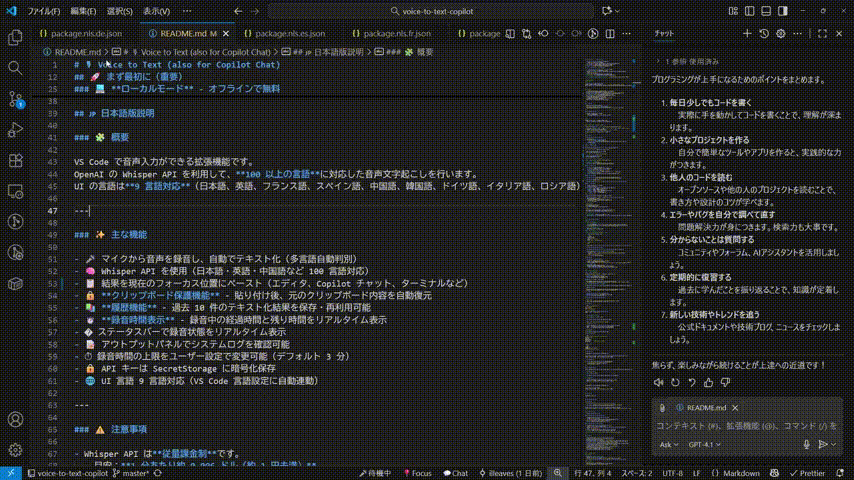
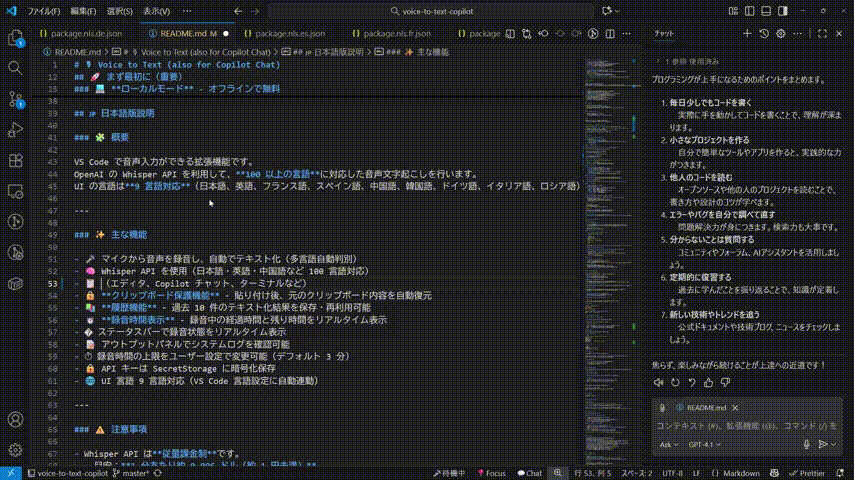

# 🎙 Voice to Text (also for Copilot Chat)

_(日本語 / English)_

\
\
\




> 🎤 **音声で Copilot Chat に質問 & コード編集** - 100 以上の言語に対応した音声入力で VS Code の生産性を向上

---

## 🌟 VS Code Speech にはない独自機能

### 🎯 **プロンプトプリセット機能** ✨

技術用語の認識精度を大幅向上！12 種類のプリセット + カスタムプロンプト対応

```diff
❌ プロンプトなし: "ジッドにプッシュしたら..."
✅ Gitプリセット:   "Gitにプッシュしたら..."

❌ プロンプトなし: "リアクトのユーズステートで..."
✅ Webプリセット:   "ReactのuseStateで..."
```

**プリセット一覧:**

- 🌐 **Web 開発** - React, Vue, TypeScript, API など
- ⚙️ **Backend 開発** - REST, GraphQL, Database, 認証 など
- 📱 **Mobile 開発** - iOS, Android, React Native など
- 🤖 **AI/ML** - PyTorch, TensorFlow, 機械学習 など
- ☁️ **Cloud** - AWS, Azure, Kubernetes など
- 🔧 **DevOps** - Docker, CI/CD, Jenkins など
- 📦 **Git** - commit, push, pull, merge など
- 🔤 **言語別** - JavaScript, TypeScript, Python

**組み合わせ可能:**

- プリセット単体使用: 「Web プリセット」のみ
- カスタム単体使用: 「MyApp, CustomAPI」のみ
- **併用で最大効果**: 「Web プリセット + MyApp, CustomAPI」

### 🎤 **フィラー除去機能** ✨NEW

「あー」「えー」「um」「uh」などのフィラーを自動除去！

```diff
❌ フィラー除去なし: "あー、この関数は、えーっと、ユーザー情報を取得します"
✅ フィラー除去あり: "この関数はユーザー情報を取得します"
```

- 音声認識結果がクリーンで読みやすい
- デフォルトで有効（設定で無効化可能）
- 議事録作成やドキュメント作成に最適

### 🚀 **VAD (無音検出) 機能** ✨NEW

Silero-VAD で無音部分を自動スキップ、処理速度が最大 50% 向上！

```
📊 処理速度の実例:
  録音時間: 63.7秒
  → 実際の発話: 31.2秒のみ処理 (48.2%削減)
  → 処理時間: わずか3秒で完了！
```

- 長い録音でも高速処理
- デフォルトで有効（設定で無効化可能）
- バッテリー節約にも貢献

### ⚡ **CPU スレッド最適化** ✨NEW

CPU コア数を自動検出し、最適なスレッド数で処理

- マルチコア CPU で処理速度が大幅向上
- 自動検出（手動設定も可能）
- 例: 16 コア CPU なら 16 スレッドで並列処理

### 🌍 **翻訳機能**

音声を自動的に英語に翻訳（Whisper 標準機能）

- グローバルチームとのコミュニケーションに最適
- 日本語で話して英語で入力

### 📚 **履歴機能**

過去 10 件の音声入力履歴を保存・再利用可能

- よく使うフレーズをワンクリックで再入力
- 履歴から編集して再利用

### 🔒 **クリップボード保護**

貼り付け後、元のクリップボード内容を自動復元

- 重要なコピー内容を失わない
- 安心して音声入力を使える

---

## 🚀 まず最初に（重要）

> 💡 この拡張機能は **2 つのモード** から選択できます：

### 🌐 **API モード** - クラウドで高精度

- 🔑 **OpenAI の API キー**が必要（有料・従量課金制）
  - 1 分あたり約 0.006 ドル（≒ 1 円未満）
  - [💰 クレジット追加](https://platform.openai.com/account/billing/overview)
  - [🔑 API キー発行](https://platform.openai.com/account/api-keys)
- ✅ **メリット**: 高精度、セットアップ簡単、メンテナンス不要
- ❌ **デメリット**: インターネット接続必須、従量課金

### 💻 **ローカルモード** - オフラインで無料

- 🛠️ **whisper.cpp のビルド**と**モデルダウンロード**が必要
- 🎧 **SOX（音声処理ツール）**のインストールが必要
  - Windows: [公式ダウンロード](https://sourceforge.net/projects/sox/files/latest/download)
  - macOS: `brew install sox`
  - Linux: `sudo apt install sox`
- ✅ **メリット**: 完全無料、オフライン動作、プライバシー保護
- ❌ **デメリット**: 初期セットアップが複雑、精度はモデルサイズに依存

> 📝 **初回起動時にセットアップウィザードが表示されます**ので、お好みのモードを選択してください。

---

## 🇯🇵 日本語版説明

### 🧩 概要

VS Code で音声入力ができる拡張機能です。
OpenAI の Whisper API を利用して、**100 以上の言語**に対応した音声文字起こしを行います。
UI の言語は**9 言語対応**（日本語、英語、フランス語、スペイン語、中国語、韓国語、ドイツ語、イタリア語、ロシア語）で、**VS Code の表示言語設定に自動的に連動**します。

---

### ✨ 主な機能

- 🎤 マイクから音声を録音し、自動でテキスト化（多言語自動判別）
- 🧠 Whisper API を使用（日本語・英語・中国語など 100 言語対応）
- 📋 生成されたテキストを「フォーカス位置」「Copilot Chat 欄」のどちらかを選んでペースト（それぞれに対応したボタンがステータスバーにも表示される）
- 🔒 **クリップボード保護機能** - 貼り付け後、元のクリップボード内容を自動復元
- 📚 **履歴機能** - 過去 10 件のテキスト化結果を保存・再利用可能
- ⏱️ **録音時間表示** - 録音中の経過時間と残り時間をリアルタイム表示
- � ステータスバーで録音状態をリアルタイム表示
- 📝 アウトプットパネルでシステムログを確認可能
- ⏱ 録音時間の上限をユーザー設定で変更可能（デフォルト 3 分）
- 🔒 API キーは SecretStorage に暗号化保存
- 🌐 UI 言語 9 言語対応（VS Code 言語設定に自動連動）

---

### ⚠️ 注意事項

- Whisper API は**従量課金制**です。
  - 目安：**1 分あたり約 0.006 ドル（約 1 円未満）**
- 無料枠はありません。クレジットがない場合は動作しません。
- 長時間録音しすぎると料金が増えるため、**上限時間（既定 3 分）**が設けられています。

---

### ⚙️ 録音時間を変更する

1.  VS Code の設定（`Ctrl + ,`）を開く
2.  「Voice to Text」で検索
3.  「録音の最大時間（秒）」を変更（10〜600 秒まで設定可）

---

### 🌍 対応言語

Whisper は**100 以上の言語**を自動認識できます。
言語を指定する必要はありません。話した言語を自動判別します。

---

### ⌨️ キーボードショートカット設定（推奨）

頻繁に使用する場合は、**キーボードショートカット**を設定することをお勧めします：

1. コマンドパレット（`Ctrl + Shift + P`）で **「基本設定: キーボードショートカットを開く」** を選択
2. 検索欄で **「voiceToText.toggle」** を検索
3. 「+」ボタンをクリックして、お好みのキー（例：`Ctrl + Alt + V`）を設定

これで、設定したキーを押すだけで録音を開始/停止できます！

---

### 🎬 デモ動画

#### 📍 Focus モード - エディタに直接貼り付け



_エディタの元の位置に音声入力結果を貼り付けるデモ_

#### 💬 Chat モード - Copilot チャットに貼り付け


_Copilot Chat に直接音声入力するデモ_

---

### 🪜 使い方

#### 📥 インストールと初期セットアップ

1.  拡張をインストール
2.  **セットアップウィザードが自動起動**します
    - **API モード**を選択 → OpenAI API キーを入力
    - **ローカルモード**を選択 → モデル（Tiny/Base/Small/Medium/Large）を選択してダウンロード
3.  セットアップ完了！

#### 🎙️ 音声入力の使い方

##### 📍 2 つの貼り付けモード

この拡張機能では、音声入力結果を**2 つの場所**に貼り付けることができます：

**1. 📍 Focus モード** - エディタの元の位置に貼り付け

- 録音停止直前にカーソルがあった場所に貼り付け
- コードやドキュメントの編集中に便利

**2. 💬 Chat モード** - Copilot Chat に貼り付け

- Copilot Chat の入力欄に直接貼り付け
- AI に質問や指示をする際に便利

##### 🖱️ ステータスバーボタンの使い方

**ステータスバー（右下）**に 3 つのボタンが表示されます：

- **🎤 待機中** - 現在の状態表示
- **📍 Focus** - Focus モードで録音開始（エディタに貼り付け）
- **💬 Chat** - Chat モードで録音開始（Copilot Chat に貼り付け）

##### 🎯 基本的な使い方

1.  **ステータスバー**で貼り付け先を選択：
    - **📍 Focus** をクリック → エディタの元の位置に貼り付け
    - **💬 Chat** をクリック → Copilot Chat に貼り付け
2.  **録音状態をリアルタイム確認**：
    - 🔴 **0:45 / 3:00** - 録音中（経過時間 / 残り時間）
    - ⏳ **処理中...** `[API]` または `[Local:Small]` - 文字起こし中
    - ✅ **貼り付け完了** - 処理完了
3.  **録音停止**：同じボタンをもう一度クリック → 自動的にテキスト化&貼り付け

##### 💡 便利な使い分け

- **📍 Focus モード**: コードのコメント、ドキュメント編集、変数名の入力など
- **💬 Chat モード**: Copilot に質問、コード説明の依頼、リファクタリングの相談など

**従来の方法**も引き続き利用可能：

- コマンドパレット（`Ctrl + Shift + P`）で **「Voice to Text: Start / Stop Recording」** を選択

#### ⚙️ モード切り替え

1.  VS Code の設定（`Ctrl + ,`）を開く
2.  「Voice to Text」で検索
3.  **「Mode」** で `api` または `local` を選択
4.  **ローカルモード**の場合、**「Local Model」**でモデルサイズを選択
    - **Tiny** (~75MB) - 最速、低精度（テスト用）
    - **Base** (~142MB) - 高速、バランス型
    - **Small** (~466MB) ★ 推奨 - 精度と速度のバランスが良い
    - **Medium** (~1.5GB) - 遅い、高精度
    - **Large** (~2.9GB) - 非常に遅い、最高精度

#### 📚 履歴機能の使い方

音声入力の結果は自動的に履歴に保存されます（最大 10 件）。

1.  コマンドパレット（`Ctrl + Shift + P`）で **「Voice to Text: Show History」** を選択
2.  過去の音声入力結果が一覧表示されます
    - 各エントリには日時とモード（API/Local）が表示されます
3.  使いたい履歴を選択すると、クリップボードにコピーされます
4.  `Ctrl + V` で貼り付け

**便利な使い方**：

- 貼り付けに失敗した場合の復元
- 以前の音声入力結果を再利用
- 録音中に別の作業をしていても、後から履歴を確認可能

**注意**：

- クリップボードは貼り付け後、100ms 後に元の内容に自動復元されます
- 録音中にコピーした内容は保護されるので、安心して使えます 🔒

### 📊 ステータス確認

- **ステータスバー**: 右下に録音状態をリアルタイム表示
- **アウトプットパネル**: 詳細ログを確認（`Ctrl+Shift+U` → 「Voice to Text (also for Copilot Chat)」選択）

---

### 🛠️ トラブルシューティング

#### API モードの問題

- **「API キーが無効」エラー**

  1. API キーが正しいか確認: [OpenAI API Keys](https://platform.openai.com/account/api-keys)
  2. クレジット残高があるか確認: [Billing](https://platform.openai.com/account/billing/overview)
  3. コマンドパレット → **「Voice to Text: Set OpenAI API Key」** で再設定

- **「API レート制限」エラー**
  - しばらく待ってから再試行してください

#### ローカルモードの問題

- **「whisper.cpp 実行ファイルが見つかりません」**

  1. whisper.cpp をビルドしてください:

     ```bash
     cd whisper.cpp
     # Windows (CMake)
     mkdir build && cd build
     cmake ..
     cmake --build . --config Release

     # macOS/Linux
     make
     ```

  2. 実行ファイルが `whisper.cpp/build/bin/Release/whisper-cli.exe` (Windows) または `whisper.cpp/main` (macOS/Linux) にあることを確認

- **「モデルファイルが見つかりません」**

  - コマンドパレット → **「Voice to Text: Run Setup Wizard」** でモデルを再ダウンロード

- **「SOX がインストールされていません」**（ローカルモードのみ）
  1. SOX をインストール:
     - Windows: [ダウンロード](https://sourceforge.net/projects/sox/files/latest/download)
     - macOS: `brew install sox`
     - Linux: `sudo apt install sox`
  2. `sox --version` が動作することを確認

#### 共通の問題

- **録音できない / マイクが動作しない**

  1. VS Code にマイクアクセス権限が与えられているか確認
  2. システム設定でマイクデバイスが有効か確認
  3. アウトプットパネル（`Ctrl+Shift+U` → 「Voice to Text (also for Copilot Chat)」）でエラー詳細を確認

- **音声が認識されない**
  - 周囲の騒音を減らし、マイクに近づいて話す
  - 録音時間が短すぎる（1-2 秒）場合は認識されないことがあります
  - ローカルモードの場合、より大きいモデル（Small 以上）を試してください

---

### 🚀 パフォーマンスノート

#### 📦 同梱されているバイナリ

この拡張機能には、各プラットフォーム用のバイナリが同梱されています:

- **Windows**: CPU 版（すべての PC で動作）
- **macOS**: Metal 版（すべての Mac で GPU 高速化）
- **Linux**: CPU 版（すべての Linux で動作）

**処理速度の目安** (Medium モデル使用時):

- CPU 版は実時間より遅めですが、短めのメモ取り用途なら十分実用的です ✅
- モデルサイズを小さくすると処理は速くなり、精度は下がります（Tiny/Base < Small < Medium < Large）

#### ⚡ GPU 高速化（オプション - 上級者向け）

お使いの PC（特に NVIDIA / AMD / Apple Silicon GPU）によっては、自分で GPU 対応版をビルドすることで**大幅な高速化**が期待できます:

**高速化のイメージ:**

- GPU 版ではエンコード工程が劇的に短縮され、体感で _数倍〜桁違い_ に速くなることがあります
- ハイエンド GPU ほど効果が高く、CPU 版との差は環境により大きく変動します

**対応 GPU:**

- **NVIDIA GPU (RTX/GTX シリーズ)**: CUDA 版をビルド
- **AMD GPU (Radeon シリーズ)**: ROCm 版をビルド (Linux のみ)
- **macOS**: すでに Metal 版が同梱されています ✅

#### 🔧 GPU 版のビルド方法（NVIDIA GPU の例）

**必要なもの:**

1. [CUDA Toolkit 12.6](https://developer.nvidia.com/cuda-downloads) (~2-3GB)
2. Visual Studio 2022 Build Tools (C++ ワークロード)

**ビルド手順:**

```bash
# 1. whisper.cppをクリーンビルド
cd whisper.cpp
rm -rf build
mkdir build && cd build

# 2. CUDA対応でビルド
cmake .. -DGGML_CUDA=ON -DCMAKE_BUILD_TYPE=Release
cmake --build . --config Release
```

**ビルドしたファイルの配置:**

1. **コマンドでフォルダーを開く** (推奨):

   ```
   Ctrl+Shift+P → "Voice to Text: Open Custom Build Folder"
   ```

   開いたフォルダーに `build/bin/Release/*` をコピー

2. **手動で配置する場合**:
   ```
   Windows: %USERPROFILE%\.vscode\voice-to-text-copilot\custom-builds\windows\
   macOS:   ~/.vscode/voice-to-text-copilot/custom-builds/macos/
   Linux:   ~/.vscode/voice-to-text-copilot/custom-builds/linux/
   ```

**必要なファイル:**

以下のファイルを上記ディレクトリにコピーしてください:

**Windows (CUDA 版):**

```bash
# whisper.cpp/build/bin/Release/ から以下をコピー
whisper-cli.exe
ggml.dll
ggml-base.dll
ggml-cpu.dll
ggml-cuda.dll      # CUDA サポート (約88MB)
whisper.dll
```

**macOS/Linux:**

```bash
whisper-cli
libggml.so (または .dylib)
libwhisper.so (または .dylib)
```

**配置後の確認:**

音声入力を実行すると、ログに以下のように表示されます:

```
Found whisper executable: ~/.vscode/voice-to-text-copilot/custom-builds/windows/whisper-cli.exe
whisper_backend_init_gpu: found 1 CUDA devices  ← GPU検出成功!
```

**検出の優先順位:**

1. **ユーザーディレクトリのカスタムビルド** (GPU 版) ← 最優先
   - `~/.vscode/voice-to-text-copilot/custom-builds/<platform>/`
2. **拡張機能ディレクトリ** (CPU 版) ← デフォルト
   - 拡張機能に同梱されたバイナリ

---

### 🗑️ アンインストール

拡張機能をアンインストールしても、モデルファイルとカスタムビルド(約 1GB)はユーザーディレクトリに残ります。

**完全に削除する場合:**

1. **コマンドで削除** (推奨):

   ```
   Ctrl+Shift+P → "Voice to Text: Clean Up (Remove Models & Custom Builds)"
   ```

2. **手動で削除**:
   ```
   Windows: %USERPROFILE%\.vscode\voice-to-text-copilot フォルダーを削除
   macOS/Linux: ~/.vscode/voice-to-text-copilot フォルダーを削除
   ```

---

音声入力を実行すると、ログに以下のように表示されます:

```
Found whisper executable: <パス>
whisper_backend_init_gpu: found 1 CUDA devices  ← GPU検出成功!
```

---

### ライセンス

MIT License
Copyright (c) 2025 aleaf

---

## 🇺🇸 English Description

### 🧩 Overview

A VS Code extension for **voice input** with **two operating modes**:

- **API Mode**: Cloud-based high-accuracy transcription using OpenAI's Whisper API
- **Local Mode**: Offline, free transcription using whisper.cpp

Supports over **100 languages** for speech recognition with automatic detection.
The extension UI supports **9 languages** (Japanese, English, French, Spanish, Chinese, Korean, German, Italian, Russian) and automatically follows your VS Code display language setting.

---

## 🌟 Unique Features Not in VS Code Speech

### 🎯 **Prompt Preset Feature** ✨NEW

Dramatically improve technical term recognition accuracy! 12 preset types + custom prompt support

```diff
❌ Without prompt: "I pushed to jit..."
✅ Git preset:     "I pushed to Git..."

❌ Without prompt: "Using use state in react..."
✅ Web preset:     "Using useState in React..."
```

**Preset List:**

- 🌐 **Web Development** - React, Vue, TypeScript, API, etc.
- ⚙️ **Backend Development** - REST, GraphQL, Database, Auth, etc.
- 📱 **Mobile Development** - iOS, Android, React Native, etc.
- 🤖 **AI/ML** - PyTorch, TensorFlow, Machine Learning, etc.
- ☁️ **Cloud** - AWS, Azure, Kubernetes, etc.
- 🔧 **DevOps** - Docker, CI/CD, Jenkins, etc.
- 📦 **Git** - commit, push, pull, merge, etc.
- 🔤 **Language-specific** - JavaScript, TypeScript, Python

**Combinable:**

- Preset only: "Web preset" alone
- Custom only: "MyApp, CustomAPI" alone
- **Best results**: "Web preset + MyApp, CustomAPI"

### 🌍 **Translation Feature**

Automatically translate speech to English (Whisper standard feature)

- Perfect for global team communication
- Speak in Japanese, input in English

### 📚 **History Feature**

Save and reuse last 10 voice input results

- One-click re-input of frequently used phrases
- Edit and reuse from history

### 🔒 **Clipboard Protection**

Automatically restore original clipboard content after pasting

- Never lose important copied content
- Safe to use voice input anytime

---

### 🚀 Getting Started

> 💡 Choose between **two modes**:

#### 🌐 **API Mode** - Cloud, High Accuracy

- 🔑 Requires **OpenAI API Key** (paid, pay-as-you-go)
  - ~$0.006 per minute (~¥1/min)
  - [💰 Add Credits](https://platform.openai.com/account/billing/overview)
  - [🔑 Get API Key](https://platform.openai.com/account/api-keys)
- ✅ **Pros**: High accuracy, easy setup, no maintenance
- ❌ **Cons**: Requires internet, pay-per-use

#### 💻 **Local Mode** - Offline, Free

- 🛠️ Requires **whisper.cpp build** and **model download**
- 🎧 Requires **SOX** (audio processing tool)
  - Windows: [Official Download](https://sourceforge.net/projects/sox/files/latest/download)
  - macOS: `brew install sox`
  - Linux: `sudo apt install sox`
- ✅ **Pros**: Completely free, offline operation, privacy protection
- ❌ **Cons**: Complex initial setup, accuracy depends on model size

> 📝 **Setup wizard will guide you** on first launch to choose your preferred mode.

---

### ✨ Features

- 🎤 Two operation modes: **API (cloud)** or **Local (offline)**
- 🎙️ Record and transcribe your voice (auto language detection)
- 🧠 Supports 100+ languages via Whisper
- 📋 Paste generated text to either "Focus position" or "Copilot Chat field" with dedicated buttons displayed in the status bar
- 🔒 **Clipboard protection** - Automatically restores original clipboard content after pasting
- 📚 **History feature** - Saves last 10 transcription results for reuse
- ⏱️ **Recording timer** - Real-time display of elapsed time and remaining time during recording
- � Real-time recording status display in status bar with mode indicator `[API]` / `[Local:Small]`
- 🎨 Visual feedback: spinning icon during processing, color-coded status
- 📝 System logs available in Output panel
- ⏱ Adjustable recording limit (default: 3 minutes, configurable 10-600 sec)
- 🔒 API key securely stored using VS Code SecretStorage
- 🌐 UI supports 9 languages (auto-detects from VS Code locale)
- 🔄 Easy mode switching and model selection in settings

---

### ⚠️ Important Notice

#### API Mode

- Whisper API is **pay-as-you-go (paid)**
  - Example: **$0.006 per minute (~¥1/min)**
- There is **no free tier** - requests will fail if your account has no credits
- A recording time limit (default 3 minutes) is applied to prevent accidental long sessions

#### Local Mode

- Completely **free** - no API costs
- Requires initial setup (whisper.cpp build + model download)
- Processing speed depends on your CPU performance
- Model size affects both accuracy and processing time

---

### ⚙️ Adjust Recording Limit

1.  Open VS Code settings (`Ctrl + ,`)
2.  Search for "Voice to Text"
3.  Change the **Max Record Seconds** setting (range: 10--600 seconds)

---

### 🌍 Supported Languages

Whisper automatically recognizes and transcribes speech in **100+ languages**, including Japanese, English, Chinese, Korean, Spanish, French, and more --- no manual language selection required.

---

### ⌨️ Keyboard Shortcut Setup (Recommended)

For frequent use, we recommend setting up a **keyboard shortcut**:

1. Open Command Palette (`Ctrl + Shift + P`) → **"Preferences: Open Keyboard Shortcuts"**
2. Search for **"voiceToText.toggle"**
3. Click the "+" button and assign your preferred key (e.g., `Ctrl + Alt + V`)

Now you can start/stop recording with just your assigned key combination!

---

### 🪜 How to Use

#### 📥 Installation and Initial Setup

1.  Install the extension
2.  **Setup wizard will launch automatically**
    - Choose **API Mode** → Enter your OpenAI API key
    - Choose **Local Mode** → Select a model (Tiny/Base/Small/Medium/Large) to download
3.  Setup complete!

#### 🎙️ Using Voice Input

##### 📍 Two Paste Modes

This extension offers **two paste destinations** for your voice input results:

**1. 📍 Focus Mode** - Paste to original editor position

- Pastes text where your cursor was just before stopping recording
- Perfect for coding and document editing

**2. 💬 Chat Mode** - Paste to Copilot Chat

- Pastes directly into Copilot Chat input field
- Ideal for asking questions or giving AI instructions

##### 🖱️ Status Bar Button Usage

**Three buttons appear in the status bar** (bottom right):

- **🎤Idle** - Current status display
- **📍 Focus** - Start recording in Focus mode (paste to editor)
- **💬 Chat** - Start recording in Chat mode (paste to Copilot Chat)

##### 🎯 Basic Usage

1.  **Select paste destination** from status bar:
    - Click **📍 Focus** → Paste to original editor position
    - Click **💬 Chat** → Paste to Copilot Chat
2.  **Monitor recording status** in real-time:
    - 🔴 **0:45 / 3:00** - Recording (elapsed time / remaining time)
    - ⏳ **Processing...** `[API]` or `[Local:Small]` - Transcribing
    - ✅ **Paste Complete** - Processing finished
3.  **Stop recording**: Click the same button again → automatic transcription & paste

##### 💡 Smart Usage Tips

- **📍 Focus Mode**: Code comments, documentation, variable names, etc.
- **💬 Chat Mode**: Ask Copilot questions, request code explanations, refactoring consultations, etc.

**Traditional method** still available:

- Open Command Palette (`Ctrl + Shift + P`) → **"Voice to Text: Start / Stop Recording"**

#### ⚙️ Switching Modes

1.  Open VS Code settings (`Ctrl + ,`)
2.  Search for "Voice to Text"
3.  Change **"Mode"** to `api` or `local`
4.  For **Local Mode**, select **"Local Model"** size:
    - **Tiny** (~75MB) - Fastest, lowest accuracy (for testing)
    - **Base** (~142MB) - Fast, balanced
    - **Small** (~466MB) ★Recommended - Good balance of accuracy and speed
    - **Medium** (~1.5GB) - Slow, high accuracy
    - **Large** (~2.9GB) - Very slow, highest accuracy

#### 📚 Using History Feature

Voice input results are automatically saved to history (up to 10 items).

1.  Open Command Palette (`Ctrl + Shift + P`) → **"Voice to Text: Show History"**
2.  Past transcription results are displayed as a list
    - Each entry shows timestamp and mode (API/Local)
3.  Select the desired history item to copy to clipboard
4.  Paste with `Ctrl + V`

**Useful scenarios**:

- Recover from failed paste operations
- Reuse previous transcription results
- Review history even while working on other tasks during recording

**Note**:

- Clipboard is automatically restored to original content 100ms after pasting
- Content copied during recording is protected 🔒

### 📊 Status Monitoring

- **Status Bar**: Real-time recording status display in bottom bar
- **Output Panel**: Detailed logs available (`Ctrl+Shift+U` → Select "Voice to Text (also for Copilot Chat)")

---

### 🛠️ Troubleshooting

#### API Mode Issues

- **"Invalid API Key" Error**

  1. Verify your API key: [OpenAI API Keys](https://platform.openai.com/account/api-keys)
  2. Check credit balance: [Billing](https://platform.openai.com/account/billing/overview)
  3. Command Palette → **"Voice to Text: Set OpenAI API Key"** to reconfigure

- **"API Rate Limit" Error**
  - Wait a moment and try again

#### Local Mode Issues

- **"whisper.cpp executable not found"**

  1. Build whisper.cpp:

     ```bash
     cd whisper.cpp
     # Windows (CMake)
     mkdir build && cd build
     cmake ..
     cmake --build . --config Release

     # macOS/Linux
     make
     ```

  2. Verify executable exists at `whisper.cpp/build/bin/Release/whisper-cli.exe` (Windows) or `whisper.cpp/main` (macOS/Linux)

- **"Model file not found"**

  - Command Palette → **"Voice to Text: Run Setup Wizard"** to re-download the model

- **"SOX not installed"** (Local mode only)
  1. Install SOX:
     - Windows: [Download](https://sourceforge.net/projects/sox/files/latest/download)
     - macOS: `brew install sox`
     - Linux: `sudo apt install sox`
  2. Verify `sox --version` works

#### Common Issues

- **Can't record / Microphone not working**

  1. Verify VS Code has microphone access permissions
  2. Check microphone device is enabled in system settings
  3. Check Output Panel (`Ctrl+Shift+U` → "Voice to Text (also for Copilot Chat)") for detailed errors

- **Speech not recognized**
  - Reduce background noise and speak closer to the microphone
  - Very short recordings (1-2 seconds) may not be recognized
  - For local mode, try a larger model (Small or above)

---

### 🚀 Performance Notes

#### 📦 Pre-built Binaries

This extension includes binaries for each platform:

- **Windows**: CPU version (works on all PCs)
- **macOS**: Metal version (GPU-accelerated on all Macs)
- **Linux**: CPU version (works on all Linux systems)

**Processing Characteristics** (Medium model):

- CPU build processes slower than real-time, but is fine for short notes and typical editor workflows ✅
- Smaller models trade accuracy for speed (Tiny/Base < Small < Medium < Large)

#### ⚡ GPU Acceleration (Optional - Advanced Users)

Depending on your hardware, you can build a GPU-accelerated version for a **significant speedup**:

**What to expect:**

- GPU builds dramatically reduce the encoder phase; the overall speedup can range from a few times faster to an order of magnitude faster
- Higher‑end GPUs see larger gains; exact numbers vary widely by GPU, driver, model size, and system load

**Supported GPUs:**

- **NVIDIA GPU (RTX/GTX series)**: Build CUDA version
- **AMD GPU (Radeon series)**: Build ROCm version (Linux only)
- **macOS**: Metal version already included ✅

#### 🔧 Building GPU Version (NVIDIA GPU Example)

**Requirements:**

1. [CUDA Toolkit 12.6+](https://developer.nvidia.com/cuda-downloads)
2. Visual Studio 2022 (Windows) or GCC/Clang (Linux/macOS)

**Windows Build Steps:**

```powershell
# 1. Navigate to whisper.cpp directory
cd whisper.cpp

# 2. Clean and create build directory
Remove-Item -Recurse -Force build -ErrorAction SilentlyContinue
mkdir build
cd build

# 3. Configure with CUDA support
cmake .. -G "Visual Studio 17 2022" -A x64 -DGGML_CUDA=ON -DCMAKE_BUILD_TYPE=Release -T cuda=12.6

# 4. Build (5-10 minutes)
cmake --build . --config Release -j 8

# 5. Copy to user directory
$customBuildDir = "$env:USERPROFILE\.vscode\voice-to-text-copilot\custom-builds\windows"
New-Item -ItemType Directory -Path $customBuildDir -Force
Copy-Item bin\Release\whisper-cli.exe $customBuildDir\
Copy-Item bin\Release\*.dll $customBuildDir\
```

**Required Files:**

Copy the following files from `build/bin/Release/`:

```
whisper-cli.exe
ggml.dll
ggml-base.dll
ggml-cpu.dll
ggml-cuda.dll      # CUDA support (~88MB)
whisper.dll
```

**File Locations:**

User directory custom builds are automatically prioritized:

1. **User directory** (highest priority): `~/.vscode/voice-to-text-copilot/custom-builds/<platform>/`
2. **Extension directory** (default): Built-in CPU version

---

### License

MIT License
Copyright (c) 2025 aleaf

---

## 🧾 Marketplace Short Description / Keywords

**日本語:**

> 🎙️ Whisper 音声入力 - API モード（クラウド・高精度）とローカルモード（オフライン・無料）から選択可能。100 言語対応の音声認識でエディタや Copilot Chat に直接入力。UI9 言語対応。

**English:**

> 🎙️ Voice to Text - Choose between API mode (cloud, high-accuracy) or Local mode (offline, free). 100+ language support for speech recognition. Direct input to editor and Copilot Chat. UI in 9 languages.

```json
"description": "🎙️ Voice input for VS Code using OpenAI Whisper API (9 UI languages, 100+ speech languages, Copilot compatible)",
"keywords": ["whisper", "voice input", "speech to text", "multilingual", "openai", "microphone", "copilot", "ai", "transcription"],
"categories": ["AI", "Other", "Productivity"]
```
